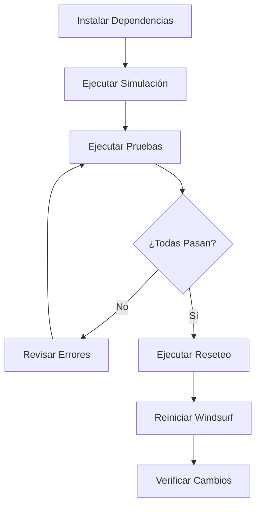

# 🔧 Windsurf Reset Tool

[](https://github.com/FlacoAfk/windsurf-reset-tool)
[](https://www.python.org/downloads/)
[](https://opensource.org/licenses/MIT)
[](LICENSE)

> 🎓 **Proyecto Educativo**: Herramienta para estudiar el manejo de estado y persistencia de datos en aplicaciones de escritorio.

Una herramienta completa en Python para resetear los identificadores de dispositivo y datos de sesión de Windsurf, con el propósito de entender cómo las aplicaciones manejan la autenticación y el estado del usuario.

## ⚠️ Propósito Educativo

Este proyecto fue creado con **fines educativos** para:
- 📚 Aprender sobre manejo de estado en aplicaciones desktop
- 🔍 Estudiar sistemas de persistencia de datos
- 💻 Practicar Python y administración de sistemas
- 🛠️ Comprender arquitectura de configuración de aplicaciones
- 🧪 Implementar suites de pruebas y validación

**No está destinado a eludir términos de servicio.** Los usuarios son responsables de usar esta herramienta de acuerdo con las políticas de Windsurf y las leyes aplicables.

## 🌟 Características

### ✨ Funcionalidades Principales
- 🗑️ **Limpieza completa** de 15+ tipos de archivos (cookies, cache, sesiones)
- 🆔 **Reseteo de identificadores** de dispositivo
- 🔐 **Eliminación de datos de autenticación**
- 💾 **Backups automáticos** con timestamp
- 🔍 **Detección automática** de procesos de Windsurf
- ⚡ **Cierre automático** de la aplicación si está en ejecución

### 🧪 Suite de Pruebas Completa
- ✅ **Simulación dry-run** - Ver qué hará sin hacer cambios
- ✅ **Pruebas intensivas** - Verificar configuración del sistema
- ✅ **Verificación post-reseteo** - Confirmar que los cambios se aplicaron
- ✅ **Scripts de inicio rápido** - Ejecutar con un click

### 📚 Documentación Exhaustiva
- 📖 Guías paso a paso en español
- 🎯 Instrucciones de inicio rápido
- 🔧 Documentación técnica detallada
- 💡 Solución de problemas
- 📝 Changelog completo

## 🚀 Instalación

### Requisitos Previos
- Python 3.7 o superior
- pip (gestor de paquetes de Python)

### Instalación Rápida

```bash
# Clonar el repositorio
git clone https://github.com/FlacoAfk/windsurf-reset-tool.git
cd windsurf-reset-tool

# Instalar dependencias
pip install -r requirements.txt
```

## 📖 Uso

### Opción 1: Scripts de Inicio Rápido (Windows)

```bash
# 1. Ver simulación (SEGURO - No hace cambios)
run_simulation.bat

# 2. Ejecutar pruebas (SEGURO - No hace cambios)
run_tests.bat

# 3. Ejecutar reseteo real
run_reset.bat
```

### Opción 2: Comandos Manuales

```bash
# Ver simulación
python simulate_reset.py

# Ejecutar pruebas
python test_script.py

# Ejecutar reseteo
python windsurf_reset.py

# Verificar cambios después
python verify_changes.py
```

## 🎯 Flujo de Trabajo Recomendado



## 📁 Estructura del Proyecto

```
windsurf-reset-tool/
├── 🔧 Scripts Principales
│   ├── windsurf_reset.py      # Script principal de reseteo
│   ├── run_reset.bat          # Inicio rápido (Windows)
│   └── requirements.txt       # Dependencias Python
│
├── 🧪 Suite de Pruebas
│   ├── test_script.py         # Pruebas intensivas
│   ├── simulate_reset.py      # Simulación dry-run
│   ├── verify_changes.py      # Verificación post-reseteo
│   ├── check_windsurf.py      # Verificador de procesos
│   ├── run_tests.bat          # Ejecuta pruebas
│   └── run_simulation.bat     # Ejecuta simulación
│
├── 📚 Documentación
│   ├── README.md              # Este archivo
│   ├── START_HERE.txt         # Inicio rápido
│   ├── GUIA_RAPIDA.md         # Guía paso a paso
│   ├── GUIA_PRUEBAS.md        # Uso de pruebas
│   ├── README_ES.md           # Documentación técnica
│   ├── INSTRUCCIONES_FINALES.md
│   ├── RESUMEN_MEJORAS.md     # Qué se mejoró
│   └── CHANGELOG.md           # Historial de versiones
│
├── ⚙️ Configuración
│   ├── .gitignore             # Archivos ignorados por git
│   ├── LICENSE                # Licencia MIT
│   └── version.py             # Sistema de versionamiento
│
└── 📝 GitHub
    └── .github/
        └── workflows/         # GitHub Actions (futuro)
```

## 🔍 ¿Qué Hace Exactamente?

### Archivos que Elimina
```
%APPDATA%\Windsurf\
├── 🗑️ Cookies                    (Tokens de sesión)
├── 🗑️ Local Storage              (Datos persistentes - API keys)
├── 🗑️ Session Storage            (Sesiones temporales)
├── 🗑️ Cache\                     (Cache general)
├── 🗑️ IndexedDB\                 (Base de datos local)
├── 🗑️ User\globalStorage\codeium.windsurf\
├── 🗑️ User\workspaceStorage\
└── 🗑️ logs\
```

### Modificaciones en storage.json
- ✅ Elimina claves de telemetría antiguas
- ✅ Elimina claves de autenticación
- ✅ Genera 3 nuevos identificadores únicos:
  - `telemetry.machineId` (64 caracteres hex)
  - `telemetry.macMachineId` (64 caracteres hex)
  - `telemetry.devDeviceId` (UUID v4)

## 🛡️ Seguridad y Backups

- ✅ **Backups automáticos** con timestamp antes de cualquier cambio
- ✅ **Scripts de prueba seguros** que no modifican nada
- ✅ **Simulación dry-run** para ver qué hará antes de ejecutar
- ✅ **Verificación post-reseteo** para confirmar cambios

### Restaurar desde Backup
```bash
# Los backups se guardan como:
# storage.json.backup_YYYYMMDD_HHMMSS

# Para restaurar:
# 1. Ve a: %APPDATA%\Windsurf\User\globalStorage\
# 2. Renombra el backup a: storage.json
# 3. Reinicia Windsurf
```

## 📊 Características Técnicas

### Compatibilidad
- ✅ Windows 10/11
- ✅ macOS (Monterey+)
- ✅ Linux (Ubuntu, Debian, Fedora)

### Dependencias
- `rich >= 13.0.0` - Interfaz de usuario mejorada
- `psutil >= 5.9.0` - Detección de procesos (opcional pero recomendado)

### Python
- Versión mínima: 3.7
- Recomendada: 3.9+

## 🧪 Pruebas

### Ejecutar Suite de Pruebas
```bash
# Todas las pruebas
python test_script.py

# Solo simulación
python simulate_reset.py

# Verificar después del reseteo
python verify_changes.py
```

### Resultados Esperados
```
📊 Total: 6 pruebas
✅ Pasadas: 6
❌ Falladas: 0
```

## 📝 Versionamiento

Este proyecto usa [Semantic Versioning](https://semver.org/):
- **MAJOR** (X.0.0): Cambios incompatibles en la API
- **MINOR** (0.X.0): Nueva funcionalidad compatible
- **PATCH** (0.0.X): Corrección de bugs compatible

### Versión Actual: 2.0.0

Ver [CHANGELOG.md](CHANGELOG.md) para el historial completo.

## 🤝 Contribuir

¡Las contribuciones son bienvenidas! Este es un proyecto educativo.

1. Fork el proyecto
2. Crea una rama para tu feature (`git checkout -b feature/AmazingFeature`)
3. Commit tus cambios (`git commit -m 'Add: Amazing Feature'`)
4. Push a la rama (`git push origin feature/AmazingFeature`)
5. Abre un Pull Request

Ver [CONTRIBUTING.md](CONTRIBUTING.md) para más detalles.

## 📜 Licencia

Este proyecto está bajo la Licencia MIT - ver el archivo [LICENSE](LICENSE) para más detalles.

### ⚠️ Disclaimer Educativo

Este software se proporciona con **fines educativos**. Los autores no fomentan ni apoyan la elusión de acuerdos de licencia de software o términos de servicio. Los usuarios son responsables de asegurar que su uso de esta herramienta cumple con todas las leyes aplicables y los términos de servicio de Windsurf.

## 🙏 Agradecimientos

- [Rich](https://github.com/Textualize/rich) - Por la hermosa interfaz de terminal
- [psutil](https://github.com/giampaolo/psutil) - Por la detección de procesos
- Comunidad de Python - Por las herramientas y bibliotecas

## 📞 Soporte

- 📖 **Documentación**: Lee [INSTRUCCIONES_FINALES.md](INSTRUCCIONES_FINALES.md)
- 🐛 **Reportar Bugs**: [Issues](https://github.com/FlacoAfk/windsurf-reset-tool/issues)
- 💬 **Discusiones**: [Discussions](https://github.com/FlacoAfk/windsurf-reset-tool/discussions)

## 🔗 Enlaces

- [Documentación Completa](README_ES.md)
- [Guía Rápida](GUIA_RAPIDA.md)
- [Guía de Pruebas](GUIA_PRUEBAS.md)
- [Changelog](CHANGELOG.md)

---

<div align="center">

**Hecho con ❤️ para la comunidad de aprendizaje de Python**

[⭐ Star](https://github.com/FlacoAfk/windsurf-reset-tool) • [🐛 Report Bug](https://github.com/FlacoAfk/windsurf-reset-tool/issues) • [✨ Request Feature](https://github.com/FlacoAfk/windsurf-reset-tool/issues)

</div>
